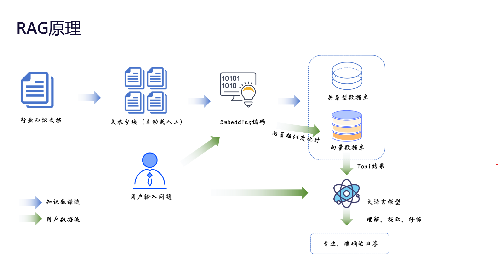

# 心流映像

> AI 驱动的心理动态追踪与辅助诊疗系统

本 README 根据项目展示 PPT 整理，适合作为课程设计、比赛项目或作品集仓库首页说明。
<video controls width="900" src="https://github.com/user-attachments/assets/e2232a2a-6066-4128-8c67-00383b2a040a"></video>
## 项目简介

`心流映像` 聚焦现代社会中日益突出的心理健康问题，尝试通过人工智能技术降低心理支持服务的使用门槛，缓解传统心理咨询中存在的资源紧张、费用较高、诊断依据有限、交互方式僵化等问题。

项目以大语言模型与心理分析能力为核心，结合语音交互、情绪识别、数据分析与可视化、网页推送等模块，构建一个面向用户的心理动态追踪与辅助系统。系统希望帮助用户更便捷地表达情绪状态，也为后续分析、报告生成和辅助判断提供支持。

## 背景与痛点

当前心理健康服务面临几个现实问题：

- 心理咨询资源分布不均，专业医生供给有限
- 传统问诊信息来源单一，动态情绪数据不足
- 线下咨询时间与经济成本较高
- 用户在表达情绪时存在顾虑，沟通效率不稳定

针对这些问题，`心流映像` 希望提供一个更方便、更高效、面向大众的智能化辅助方案。

## 核心功能

- `EmoLLM 心理模型`
  结合心理领域知识与大语言模型能力，对用户输入进行理解、提取和辅助分析。
- `语音交互`
  支持更自然的表达方式，降低文本输入门槛，提升交互流畅度。
- `情绪识别`
  对用户表达内容进行情绪分类与倾向判断，辅助识别潜在心理状态变化。
- `数据分析与可视化`
  对对话与情绪数据进行统计分析，生成图表与结构化结果。
- `网页推送与展示`
  通过 Web 页面展示系统入口、功能模块与分析结果，提升可访问性与展示效果。
- `辅助诊疗报告生成`
  将对话内容、情绪分布与文本特征整理为可阅读的心理评估报告。

## 技术思路

项目整体思路可以概括为：

1. 用户通过文本或语音与系统进行交互
2. 系统收集对话内容并进行情绪识别与语义分析
3. 基于心理知识库与 RAG 检索增强生成机制，为模型提供更可靠的知识支撑
4. 将分析结果转化为情绪分布、词频统计、心理状态解读等可视化内容
5. 生成心理评估报告，并通过网页端进行展示或推送

其中，RAG 的核心流程为：

`行业知识文档 -> 文本分块 -> Embedding 编码 -> 向量数据库检索 -> 大语言模型生成专业回答`

## 项目亮点

- `AI + 心理健康` 结合，关注真实社会需求
- 引入 `RAG` 机制，提升回答的专业性与可解释性
- 兼顾 `交互、识别、分析、可视化、报告生成` 的完整链路
- 通过量化分析辅助理解用户情绪，而不只停留在聊天层面
- 面向大众服务场景，具有一定的落地与推广价值

## 效果展示

### 1. 网页首页

系统提供网页端入口，用户可在首页完成了解、注册和登录等操作。

### 2. RAG 原理示意

项目通过知识文档、向量检索和大语言模型联动，为心理分析与问答提供知识支撑。

### 3. 心理评估报告

系统能够结合对话分析结果，生成结构化的心理评估报告，辅助用户理解自身情绪状态。

## 数据分析展示

根据 PPT 展示，系统支持将分析结果转化为多种图表形式，包括但不限于：

- 情感饼状图：展示不同情绪类别的比例分布
- 词频直方图：统计高频情绪或语义关键词
- 报告页总结：对用户状态进行结构化解释与归纳

这类可视化结果有助于：

- 提高情绪识别结果的直观性
- 辅助进行趋势判断和决策分析
- 帮助用户更清晰地理解自己的表达与状态

## 应用场景

- 大学生心理健康辅助筛查
- 日常情绪记录与自我觉察
- 社区或校园心理服务平台
- 心理咨询前的初步信息收集
- 面向大众的心理健康科普与支持服务

## 项目价值

`心流映像` 不仅是一个技术实现项目，也体现了“用科技服务社会、用技术传递温暖”的设计理念。项目希望通过更低门槛、更自然的交互方式，让更多人能够及时关注自己的心理状态，在需要时获得支持与帮助。

## 后续可优化方向

- 提升语音识别与情绪识别准确率
- 引入长期会话记忆，实现更连续的心理动态跟踪
- 加强隐私保护与敏感数据安全设计
- 增加更多专业心理知识库与案例数据
- 完善医生端或管理端的辅助分析界面
- 推进真实场景验证，评估系统实用性与稳定性

## 致谢

感谢项目成员围绕心理健康议题所做的设计、调研与实现工作。希望这个项目能够在技术探索之外，也为心理健康服务提供一点实际价值。
